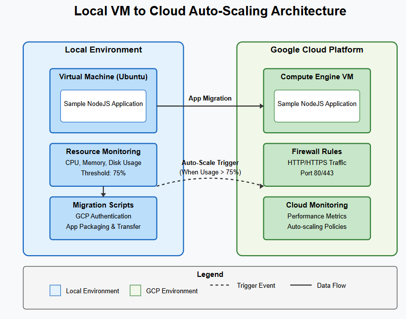

# Local VM to Cloud Auto-Scaling System

## Overview
This repository contains an automated system that monitors resource usage on a local virtual machine and triggers migration to Google Cloud Platform (GCP) when resource utilization exceeds a predefined threshold (75%). The solution employs bash scripting for resource monitoring, GCP's Compute Engine for cloud infrastructure, and a sample Node.js application to demonstrate the auto-scaling functionality.

## Features
- Automated resource monitoring (CPU, memory, disk)
- Threshold-based cloud migration triggering
- GCP infrastructure provisioning
- Application deployment and configuration
- Stateful migration tracking

## Architecture
The system follows a hybrid cloud architecture with components distributed between the local environment and GCP:



```
┌─────────────────────┐                      ┌─────────────────────┐
│   Local VM (VBox)   │                      │     GCP Instance    │
│                     │                      │                     │
│ ┌─────────────────┐ │    Auto-Migration    │ ┌─────────────────┐ │
│ │ Resource Monitor│ │─────────────────────▶│ │  Node.js App    │ │
│ └─────────────────┘ │                      │ └─────────────────┘ │
│ ┌─────────────────┐ │                      │                     │
│ │   Node.js App   │ │                      │                     │
│ └─────────────────┘ │                      │                     │
└─────────────────────┘                      └─────────────────────┘
```

## Prerequisites
- VirtualBox (6.0+)
- Ubuntu 22.04 LTS ISO
- Google Cloud Platform account with billing enabled
- Google Cloud SDK

## Installation

### 1. Local VM Setup
```bash
# Create VM using VirtualBox CLI
VBoxManage createvm --name "AutoScaleVM" --ostype Ubuntu_64 --register
VBoxManage modifyvm "AutoScaleVM" --memory 2048 --cpus 2
VBoxManage createhd --filename "AutoScaleVM.vdi" --size 20000
VBoxManage storagectl "AutoScaleVM" --name "SATA Controller" --add sata
VBoxManage storageattach "AutoScaleVM" --storagectl "SATA Controller" --port 0 --device 0 --type hdd --medium "AutoScaleVM.vdi"
VBoxManage storageattach "AutoScaleVM" --storagectl "SATA Controller" --port 1 --device 0 --type dvddrive --medium ubuntu-22.04-desktop-amd64.iso
```

### 2. System Dependencies
```bash
sudo apt-get update
sudo apt-get install -y bc htop nodejs npm stress git curl unzip
```

### 3. Google Cloud SDK Installation
```bash
curl -O https://dl.google.com/dl/cloudsdk/channels/rapid/downloads/google-cloud-sdk-397.0.0-linux-x86_64.tar.gz
tar -xzf google-cloud-sdk-397.0.0-linux-x86_64.tar.gz
./google-cloud-sdk/install.sh
```

### 4. Project Setup
```bash
# Clone this repository
git clone https://github.com/yourusername/local-vm-cloud-autoscaling.git
cd local-vm-cloud-autoscaling

# Set up directories
sudo mkdir -p /opt/sample-app
sudo mkdir -p /etc/gcp
sudo mkdir -p /usr/local/bin
sudo mkdir -p /var/log

# Copy scripts
sudo cp scripts/monitor_resources.sh /usr/local/bin/
sudo cp scripts/migrate_to_gcp.sh /usr/local/bin/
sudo chmod +x /usr/local/bin/monitor_resources.sh
sudo chmod +x /usr/local/bin/migrate_to_gcp.sh

# Copy application
sudo cp -r app/* /opt/sample-app/
```

### 5. GCP Configuration
1. Create a new GCP project
2. Enable the Compute Engine API
3. Create a service account with the following roles:
   - Compute Admin
   - Service Account User
   - Storage Admin
4. Download the service account key and save it to `/etc/gcp/service-account-key.json`
5. Secure the credentials:
   ```bash
   sudo chmod 600 /etc/gcp/service-account-key.json
   ```

### 6. Set Up Monitoring Schedule
```bash
# Add cron job to run monitoring every 5 minutes
(crontab -l 2>/dev/null; echo "*/5 * * * * /usr/local/bin/monitor_resources.sh") | crontab -
```

## Usage

### Sample Application
The Node.js application provides the following endpoints:

| Endpoint | Description | Example |
|----------|-------------|---------|
| / | Displays system information | http://localhost:3000/ |
| /stress?duration=60 | Generates CPU load | http://localhost:3000/stress?duration=60 |
| /memory?size=500&duration=120 | Allocates memory | http://localhost:3000/memory?size=500&duration=120 |

### Starting the Application
```bash
cd /opt/sample-app
npm install
npm start
```

### Testing Auto-Scaling
```bash
# Generate high CPU load to trigger auto-scaling
curl "http://localhost:3000/stress?duration=180"

# Or generate high memory usage
curl "http://localhost:3000/memory?size=1024&duration=300"

# Alternatively, use the stress utility
stress --cpu 4 --io 2 --vm 1 --vm-bytes 1G --timeout 300s
```

## Script Details

### Resource Monitoring Script
The `monitor_resources.sh` script checks system resource utilization against predefined thresholds and triggers migration when necessary.

```bash
# Key functions:
# - get_resource_usage: Collects CPU, memory, and disk metrics
# - check_scaling_threshold: Compares against 75% threshold
# - trigger_cloud_scaling: Initiates the migration process
```

### Migration Script
The `migrate_to_gcp.sh` script handles the creation of cloud resources and application migration.

```bash
# Key functionality:
# - GCP authentication
# - Compute Engine instance creation/management
# - Application packaging and transfer
# - Cloud environment configuration
```

## Configuration
Edit the following configuration parameters in the scripts as needed:

### In migrate_to_gcp.sh:
```bash
PROJECT_ID="auto-scale-project-1234"  # Your GCP project ID
ZONE="us-central1-a"                  # Target GCP zone
INSTANCE_NAME="auto-scaled-instance"  # Name for the cloud instance
MACHINE_TYPE="e2-medium"              # VM machine type
```

## Logs
- Resource monitoring logs: `/var/log/resource_monitor.log`
- Migration logs: `/var/log/gcp_migration.log`
- Application logs: `/opt/sample-app/app.log`

## Future Enhancements
- Bi-directional scaling (scale-down capability)
- Multi-cloud support (AWS, Azure)
- Container-based migration
- Load balancing during migration
- Advanced monitoring with Prometheus and Grafana

## License
This project is licensed under the MIT License - see the LICENSE file for details.

## Acknowledgments
- Google Cloud Platform documentation
- Node.js community
